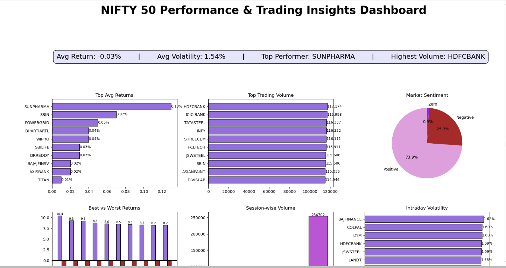
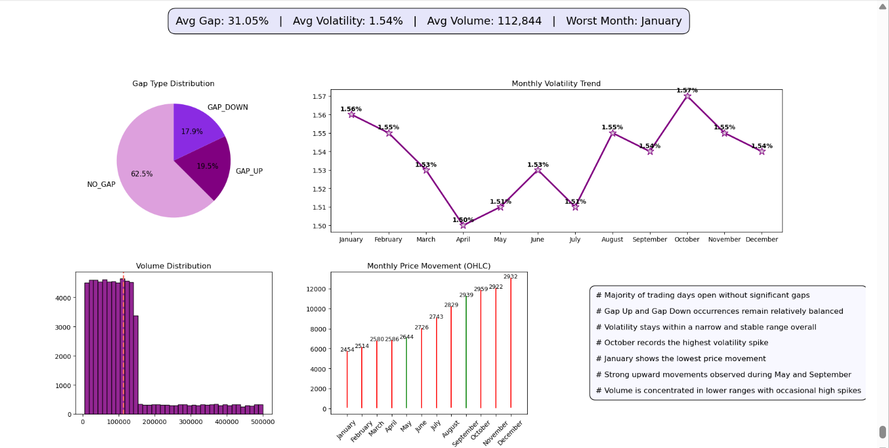

# 📊 NIFTY 50 2025 — Exploratory Data Analysis

> A structured, end-to-end EDA project on India's top 50 listed companies using Python and custom-built OHLCV data.

\---

## 🎯 Objective

To analyze historical price and volume behaviour of NIFTY 50 stocks across multiple dimensions — volatility, returns, gap patterns, and calendar effects — and derive actionable insights for traders and investors.

\---

## 🗂️ Project Overview

This project explores a custom-built NIFTY 50 dataset through 28+ business problems organized into four analytical categories:

|Category|Focus|
|-|-|
|Volatility \& Risk|Intraday swings, monthly volatility trends|
|Return \& Performance|Daily returns, best/worst months, weekday effects|
|Gap Analysis|Gap-up / gap-down frequency and magnitude|
|Volume Analysis|Distribution, skewness, high-volume detection|

A subplot-based dashboard summarizes the key findings visually.

\---

## ❓ Problem Statements

1\. Which companies show highest intraday volatility?


2\. Which companies have most daily trading activity?


3\. Which session has highest volume activity?


4\. Which companies have largest daily price ranges?


5\. Which companies give best/worst returns?


6\. What percentage of days are bullish vs bearish?


7\. Which months have highest trading activity?


8\. Which companies have most extreme daily gains/losses?


9\. How frequently do Gap Up and Gap Down occur?


10\. Which days have best/worst average returns?


11\. Which months show best/worst performance?


12\. What percentage distance is price from 52-week extremes?


13\. How does volatility change across the month?


14\. What's the distribution of trading volumes?


\---

## 📁 About the Dataset

|Attribute|Detail|
|-|-|
|Source|(NSE India)|
|Companies|50 NIFTY 50 constituents|
|Total Rows|\~62,500|
|Frequency|Daily sessions|
|Columns|Date, Ticker, Open, High, Low, Close, Volume|
|Sessions|Daily + Intraday|

\---

## 🛠️ Tools \& Technologies

!\[Python](https://img.shields.io/badge/Python-3.10-blue?logo=python)
!\[Pandas](https://img.shields.io/badge/Pandas-2.x-150458?logo=pandas)
!\[NumPy](https://img.shields.io/badge/NumPy-1.x-013243?logo=numpy)
!\[Matplotlib](https://img.shields.io/badge/Matplotlib-3.x-11557c)
!\[Seaborn](https://img.shields.io/badge/Seaborn-0.13-4C8CBF)
!\[Jupyter](https://img.shields.io/badge/Jupyter-Lab-F37626?logo=jupyter)

\---

## ⚙️ Methods Used

* **Data Cleaning** — Pre-processed Date column to extract Date features ,

null checks, duplicate removal, Computed statistical summary for core numerical features , Ensured data consistency through logical validation checks

* **Feature Engineering** — Daily Return %, Intraday Volatility %, Gap %, Gap Type categories, Month \& DayOfWeek extraction
* **Groupby Aggregation** — mean, median, std across Month and DayOfWeek
* **Distribution Analysis** — histogram with mean/median reference lines
* **Time-Series Visualization** — monthly volatility line chart, OHLC price movement
* **Comparative Analysis** — day-of-week boxplot, monthly return bar chart, monthly trend using candlestick chart
* **Dashboard** — multi-panel subplot combining KPIs and key charts

\---

## 💡 Key Insights

* 📈 **October** shows the highest intraday volatility spike across all months
* 📉 **April** is the most stable month — lowest average volatility
* 🏆 **September** delivers the best average monthly returns
* ⚠️ **January** records the weakest average monthly performance
* 📅 **Thursday** consistently shows the highest average daily returns
* 📦 Trading **volume is right-skewed** — mean significantly exceeds median
* ↔️ **\~55% of sessions** open with no significant gap from the previous close

\---

## 📊 Dashboard Preview

|Nifty 50 Performance \& Trading Insights Dashboard|Nifty 50 Market Behavior \& Volatility  Dashboard|




\---

## ▶️ How to Run

```bash
# 1. Clone the repository
git clone https://github.com/your-username/nifty50-eda.git
cd nifty50-eda

# 2. Install dependencies
pip install pandas numpy matplotlib seaborn jupyterlab

# 3. Launch Jupyter Lab
jupyter lab

# 4. Open and run the notebook
# → NIFTY50 project(1).ipynb
```

> Run all cells sequentially. The dataset CSV should be in the same directory as the notebook.

\---

## ✅ Recommendations

* Trade during **low-volatility months** (April, May) for reduced risk exposure
* **Avoid October** for conservative strategies — historically highest volatility
* Bias short-term entries toward **Thursdays** based on weekday return patterns


\---

## 👤 Author

**Prabha Burman**

[!\[Email](](mailto:your.email@example.com)prabhaburman26@gmail.com)
[!\[LinkedIn](https://www.linkedin.com/in/prabha-burman-632483325?utm\_source=share\&utm\_campaign=share\_via\&utm\_content=profile\&utm\_medium=android\_app)](https://linkedin.com/in/your-profile)

\---

*Built with Python · NIFTY 50 · NSE India*

